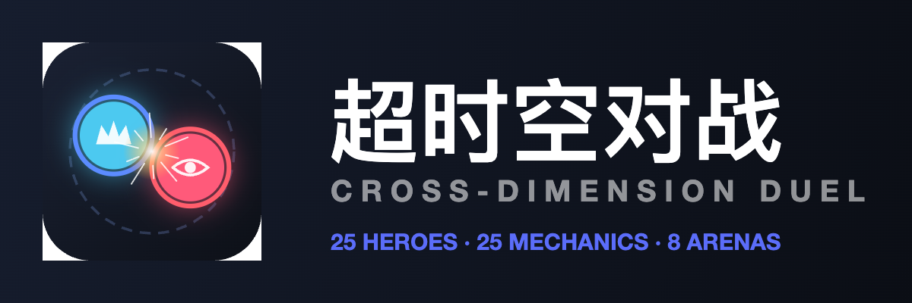
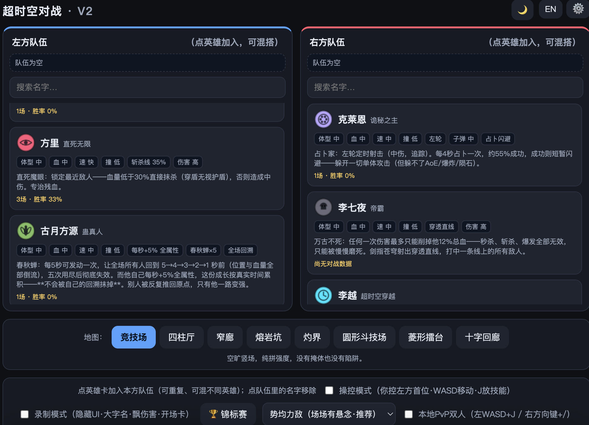
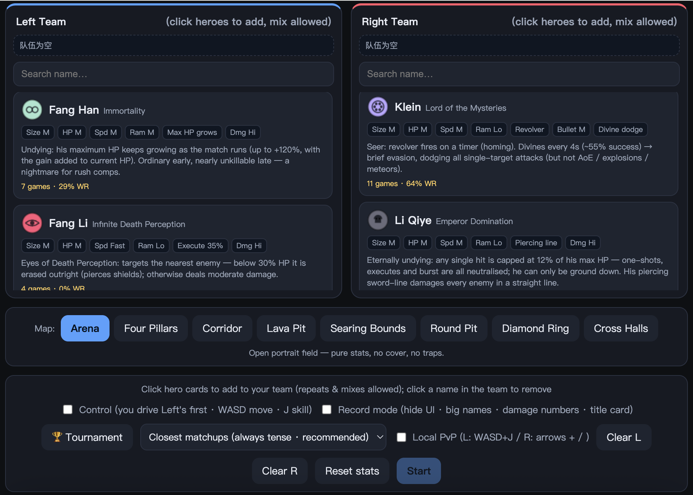
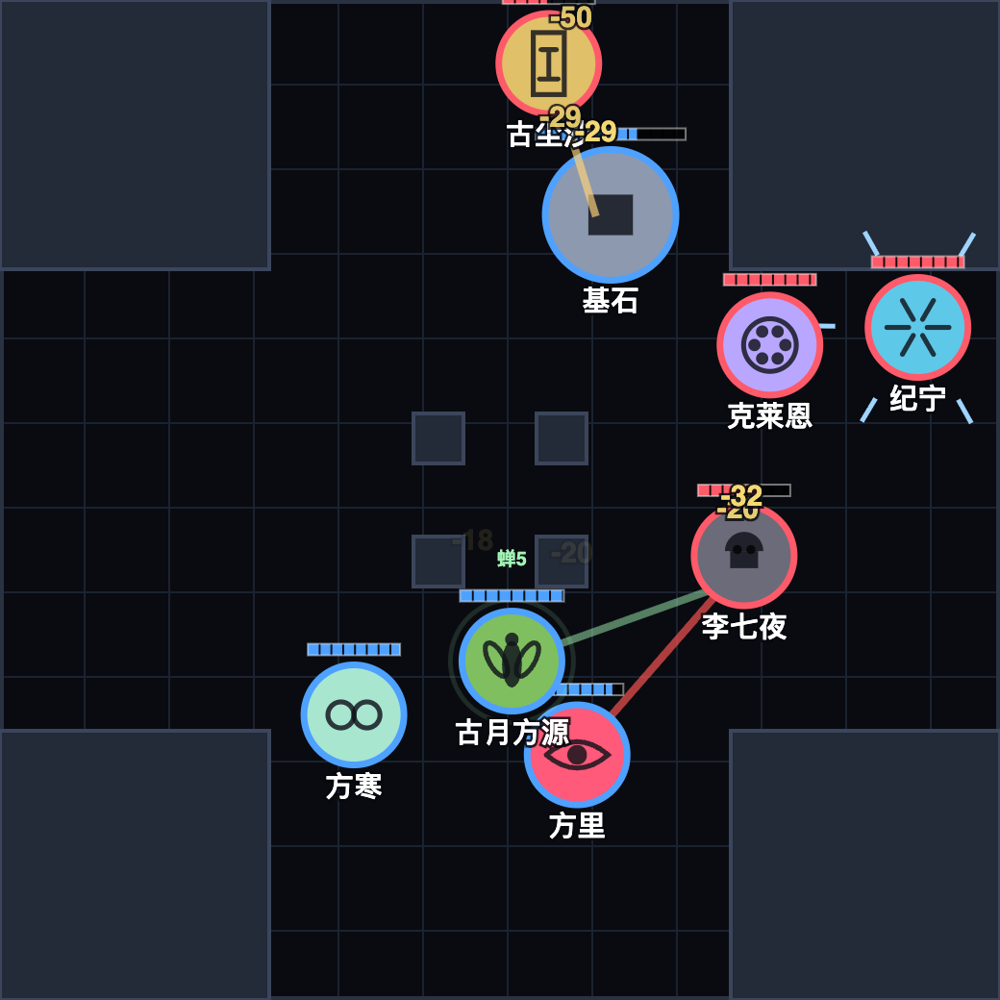
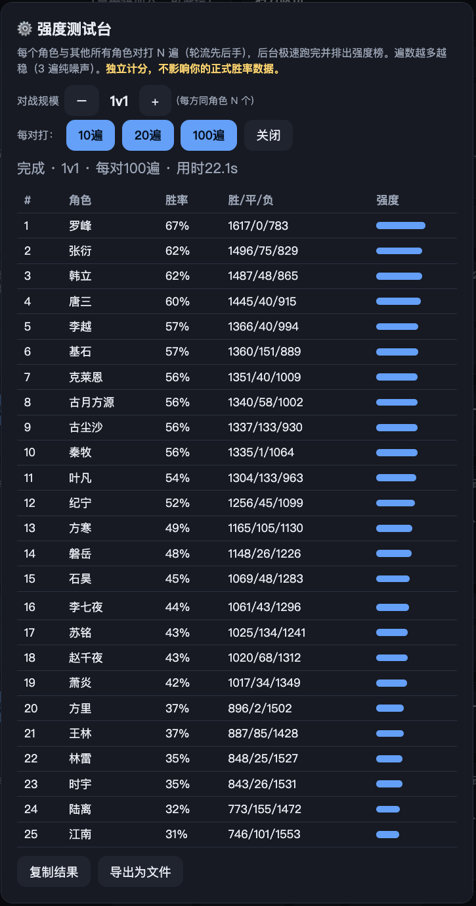

<p align="center"> 
  
</p>

<h1 align="center">超时空对战 · Cross-Dimension Duel <code>V2.1</code></h1>

[](https://larryzpl.itch.io/cross-dimension-duel)

**▶️ [Play in your browser on itch.io](https://larryzpl.itch.io/cross-dimension-duel) · 点这里直接在浏览器里玩**

A dependency-free, build-free **ball-battle auto-simulator** in the style of the viral WeChat/Bilibili "little ball" fight videos — except every ball is a **simplified skill kit of a web-novel protagonist**. Balls bounce around an arena, use their abilities, and fight until one side is left standing.

一个**零依赖、零构建**的小球对战模拟器，灵感来自微信视频号 / B 站上火的小球对战视频——只不过每个小球都是一位**玄幻小说主角的技能简化版**。小球在竞技场里弹跳、放技能，直到一方获胜。

> Built with plain HTML + Canvas + vanilla JavaScript. No build step, no libraries, no server, no package manager — just open `index.html`.
> 纯 HTML + Canvas + 原生 JS，无需构建、无依赖、无服务器、无包管理器——打开 `index.html` 即可。
> Modular by design: one file per hero, one per map, one per pluggable mechanic. Content is listed in a single `manifest.js`, so **adding a hero never touches `index.html`**.
> 结构是模块化的：一角色一文件、一地图一文件、复杂机制一文件。所有内容登记在单个 `manifest.js` 里，**加角色永远不用动 `index.html`**。

---

## ▶️ Run / 运行

Open **`index.html`** in any modern browser (double-click it), or just visit the GitHub Pages site. That's it.
用任意现代浏览器打开 **`index.html`**（双击即可），或直接访问 GitHub Pages 页面。

- Language: click the **EN / 中** button (top-right) to switch UI language. Your choice is remembered.
- 语言：点右上角 **EN / 中** 一键切换，会记住上次选择。

---

## 📸 Screenshots / 截图

<p align="center">
  
   <br/>
  
</p>
<p align="center"><i>上：26 个角色，每人独有配色与图腾 &nbsp;·&nbsp; 下：录制模式下的混战</i></p>
<p align="center"><i>Above: 26 characters, each with a unique color scheme and totem &nbsp;·&nbsp; Below: a brawl in recording mode</i></p>

## ✨ Features / 功能

- **26 heroes, 26 distinct mechanics** — contact ram, sword volley, AoE lotus, melee sweep, self-heal, bind/DoT-spread, charge one-shot, self-shield + falling-peak stun, revolver + divination dodge, life-drain, chain lightning, execute, self-nova + scaling growth, summons, blink-strike + revive, whole-field rewind, and **mitosis** (a community-contributed pluggable mechanic).
- **Tournament mode (🏆)** — a 26-hero single-elimination bracket that runs itself: 5 rounds, 25 matches, 2 byes. Default seeding uses the counter-matchup matrix to make every pairing as close to 50/50 as possible. When it ends, a **full bracket** is drawn on the result screen (losers struck through, byes marked, champion highlighted) and can be exported as a 2× PNG.
- **Skill cooldown UI** — a ring around your controlled hero fills as the skill charges; green + "READY" when castable, with a seconds countdown.
- **Team builder & NvN mix** — build each side from any mix of heroes (repeats and different heroes allowed), 1v1 up to large team fights.
- **Control mode & local PvP** — drive a hero yourself (WASD + J), or **1v1 two-player local PvP** on one keyboard (P1 WASD+J / P2 arrows + /). Skills respect cooldown and are manual-only; basic attacks (e.g. Klein's revolver) stay automatic.
- **Archetype AI** — melee chases, ranged kites, chargers flee, and one hero ("Han Li") flees & heals below half HP then re-engages.
- **Randomness** — crits, damage variance, and lotus-radius variance swing individual matches.
- **Strength Test Lab (⚙️)** — round-robin every hero vs every hero, 10/20/100 runs each, at 1v1–5v5, run instantly in the background into a power ranking. Exports JSON incl. a **counter-matchup matrix**. Scored separately from your real win-rate data.

<p align="center">
  
</p>
<p align="center"><i>强度榜不是拍脑袋定的：300 组配对 × 每组数百局，跑的是真实游戏代码</i></p>

- **Segmented HP bars** (one notch = 20 HP), shield bars, **1×–8× speed**, pause, and a 60s timeout rule so no match stalls forever.
- **Win-rate tracking** — stores only match count + wins (compact). Copy / export / import as JSON.
- **Light / dark theme** — sun/moon toggle (top-right), remembered like the language setting.
- **8 maps** with distinct shapes: rectangles, a circle, a diamond, cross-shaped corridors, plus hazard zones and an electrified boundary.

---

## 🎮 Controls / 操作

| Key | Action |
|---|---|
| **Space** | Pause / resume |
| **1 / 2 / 4 / 8** | Speed ×1 / ×2 / ×4 / ×8 |
| **WASD** / **J** | P1: move / cast skill *(control & PvP)* |
| **Arrows** / **/** | P2: move / cast skill *(local PvP)* |
| **R** | Recording mode — hides all UI, big names, floating damage numbers |
| **P** | Save a 2× high-res PNG screenshot of the current frame |

---

## 🦸 Heroes / 角色

| Hero | Source | Mechanic |
|---|---|---|
| 基石 Cornerstone | Pure Stats | Fast, tanky contact ram — can ram through shields |
| 纪宁 Ji Ning | 莽荒纪 Desolate Era | Six orbiting swords charge → homing volley → regen → repeat |
| 萧炎 Xiao Yan | 斗破苍穹 Battle Through the Heavens | Fire-lotus projectile, explodes on hit/wall — large AoE |
| 韩立 Han Li | 凡人修仙传 A Mortal's Journey | Slow heavy-blade sweep; "run & heal" 2nd phase below half HP |
| 石昊 Shi Hao | 完美世界 Perfect World | High ram damage + steady self-heal |
| 唐三 Tang San | 斗罗大陆 Douluo Dalu | Bind: slow + DoT that **spreads** to allies on contact |
| 罗峰 Luo Feng | 吞噬星空 Swallowed Star | Long charge → one-shot; **charges faster with more enemies**, floored at 6.66s |
| 克莱恩 Klein | 诡秘之主 Lord of the Mysteries | Revolver + divination → brief dodge of single-target attacks (not AoE) |
| 磐岳 Panyue | 原创 Original | Thick self-refreshing shield + falling-peak petrify |
| 赵千夜 Zhao Qianye | 永夜君王 Nightfall King | Blood drain — damage converts into own HP |
| 林雷 Linley | 盘龙 Coiling Dragon | Chain lightning, up to 3 jumps with decay |
| 方里 Fang Li | 直死无限 Infinite Death Perception | Execute — erases enemies below 35% HP (pierces shields) |
| 叶凡 Ye Fan | 遮天 Shrouding the Heavens | Self-centred AoE nova + damage grows over the match |
| 秦牧 Qin Mu | 牧神记 Records of the Human Emperor | Summons temporary herd spirits to fight |
| 王林 Wang Lin | 仙逆 Renegade Immortal | Blink-strike + revives once at half HP |
| 古尘沙 Gu Chensha | 龙符 Dragon Talisman | Enshrine — every enemy death permanently stacks +22% damage |
| 陆离 Lu Li | 不灭龙帝 Immortal Dragon Emperor | Rage — the lower his HP the harder he hits, plus knockback |
| 李七夜 Li Qiye | 帝霸 Emperor Domination | Undying — any single hit capped at 12% max HP; piercing line attack |
| 时宇 Shi Yu | 不科学御兽 Unscientific Beast Taming | One permanent pet that evolves the longer it lives |
| 张衍 Zhang Yan | 大道争锋 Dao Contention | Counter window — reflects 100% of incoming damage |
| 苏铭 Su Ming | 求魔 Beseech the Devil | Devil Mark — marked enemy takes +50% damage from ALL sources |
| 江南 Jiang Nan | 帝尊 Di Zun | Aura — allies within radius deal +30% damage |
| 方寒 Fang Han | 永生 Immortality | Eternal — max HP keeps growing all match |
| 李越 Li Yue | 超时空穿越 Cross-Time Traveller | Time rewind — snaps HP & position back 4 seconds |
| 古月方源 Fang Yuan | 蛊真人 Reverend Insanity | Spring Autumn Cicada — rewinds the WHOLE field 5→4→3→2→1s (5 uses), **reviving anyone who died in that window**; his own +5%/s growth is never undone |
| 细胞博士 Dr. Cell | 原创·哈利 Original by Harry | Mitosis — takes no HP damage; every hit splits it into two frailer cells, same-type cells fuse on contact. A community-contributed hero + the first **pluggable mechanic** |

Adding a hero = one new file in `characters/` + **one line in `manifest.js`** (never touch `index.html`). See **Project structure** below.
加角色 = `characters/` 里加一个文件 + **在 `manifest.js` 里加一行**（不用动 index.html），详见下方「项目结构」。

---

## ⚖️ Unified measurement system / 统一度量衡

Every hero's stats come from fixed tiers (edit the `M` object to rebalance globally):

| Tier | Size (r px) | HP | Damage | Range | Speed (px/s) |
|---|---|---|---|---|---|
| Low / 小·低·慢 | 19 | 80 | 9 | 45 | 95 |
| Mid / 中 | 26 | 150 | 17 | 85 | 160 |
| High / 大·高·快 | 34 | 260 | 29 | 135 | 235 |

Per-unit fine-tuning fields: `speedMul`, `hpMul`, `contactCD`, `critChance` / `critMult`.

---

## 🗺️ Roadmap / 路线图

**V2 (done):** 26 heroes / 26 mechanics · 8 maps (rect / circle / diamond / cross, obstacles, hazards, electrified bounds) · modular architecture · mixed NvN · archetype AI · crits & randomness · control mode & local PvP · skill-cooldown UI · EN/中 i18n · strength test lab.

**V3 (next):**
1. **Online multiplayer PvP** — needs a server + net-sync; a separate project.
2. NvN / mixed-team balance pass (current tuning targets 1v1).
3. Polish: hero enable/disable UI (26 is a long list), skill SFX.

📄 **[`tech_debrief.md`](tech_debrief.md)** — retrospective on four design calls I got wrong, and what caught each one (geometry bug disguised as an AI bug · balance that had fitted itself to that bug · a metric that measured the wrong thing · reasoning that got "fun" backwards).
📄 **[`技术复盘.md`](技术复盘.md)** — 同一篇复盘的中文版。

---

## 📁 Project structure / 项目结构

```
index.html          ← 冻结不动：只有 HTML/CSS + 引擎标签 + manifest + 加载器
manifest.js         ← 唯一要改的清单：列出所有机制/地图/角色的文件名
js/engine.js        ← 引擎：物理 / 循环 / 渲染 / AI / 伤害 / UI / 插件钩子
js/emblems.js       ← 角色图腾（纯 Canvas 矢量，零素材）
mechanics/*.js      ← 可插拔机制（如 mitosis 细胞分裂），用引擎钩子实现，不改引擎
characters/*.js     ← 一个角色一个文件（数据 + 英文翻译 + 自己的技能实现）
maps/*.js           ← 一张地图一个文件 × 8

cover.html          ← 工具：生成 itch.io 封面图（不是游戏的一部分）
logo.html           ← 工具：生成 logo / 字标 / favicon
```
> 加载靠 `manifest.js` + index.html 里一个 `document.write` 加载器，不用打包器。
> 顺序：emblems → engine → manifest → 机制 → 地图 → 角色 → `boot()`。
> 之所以用 `document.write` 而非动态注入：它在解析期插入的就是静态标签，
> 和手写 `<script>` 逐字等价，双击（file://）打开零兼容风险。

**加一个角色** = 新建 `characters/<id>.js` + 在 `manifest.js` 的 `characters` 数组加一行。不用碰引擎、不用碰 index.html：

```js
// characters/example.js
registerSkill('myMechanic', {
  ai:'kite',                                   // 默认AI原型 chase/kite/flee/phase
  init:(s)=>s.cd,                              // 冷却计时初值
  cd:(f,s)=>({t:f.sk.t, total:s.cd}),          // 冷却环读数
  badges:(s,L,T)=>[L('中文','English')],        // 选人卡标签
  tick(f, dt, s){ /* 每帧逻辑，okCast(f) 判断玩家是否按了技能键 */ }
});
registerHero({ id:'example', name:'示例', src:'某小说', size:'中', hp:'中',
  speed:'中', contact:'低', skill:{type:'myMechanic', cd:2.0},
  desc:'中文描述', i18n:{name:'Example', src:'Some Novel', desc:'English description'} });
```

**加一张地图** = 新建 `maps/<id>.js`：

```js
registerMap({ id:'x', name:'名字', nameEn:'Name', w:400, h:600,
  obstacles:[{x:120,y:180,r:32}],        // 圆形障碍：挡投射物、弹开小球
  hazards:[{x:200,y:300,r:105,dps:11}],  // 危险区：站里面每秒掉血
  desc:'中文', descEn:'English' });
```

> 用的是传统 `<script>` 标签而非 ES modules —— 这样双击 `index.html` 就能玩。ES modules 在 `file://` 下会被 CORS 拦死，必须起本地服务器。

## 🗺️ Maps / 地图

**8 张地图**，形状与规则各不相同：

| 地图 | 尺寸/形状 | 特点 |
|---|---|---|
| 竞技场 Arena | 400×620 矩形 | 空旷，纯拼强度 |
| 四柱厅 Four Pillars | 560×520 矩形 | 四根粗柱挡投射物、断视线 |
| 窄廊 Corridor | 240×720 细长 | 两道错位隔墙切成三段，躲无可躲 |
| 熔岩坑 Lava Pit | 520×520 矩形 | 中央大熔岩 + 对角两处小熔泉，站进去掉血 |
| 灼界 Searing Bounds | 460×560 矩形 | **四壁带电，碰墙掉血**，逼所有人往中间打 |
| 圆形斗技场 Round Pit | 540 圆形 | 无墙角可卡，中央一根巨柱 |
| 菱形擂台 Diamond Ring | 560 菱形 | 四个尖角是死亡陷阱，中央有灼烧区 |
| 十字回廊 Cross Halls | 520 十字 | 四角封死成十字通道 + 中心四根小方柱 |

## 🛠️ Tech / 技术

- No dependencies, no build step.
- Circle-circle collision (no physics engine needed — balls are circles).
- Deterministic-enough simulation; the headless test loop reuses the exact game update code, so the balance lab matches real play.

---

*A hobby project. Characters and settings belong to their respective authors; skills here are heavily simplified, non-canonical interpretations for a toy game.*
